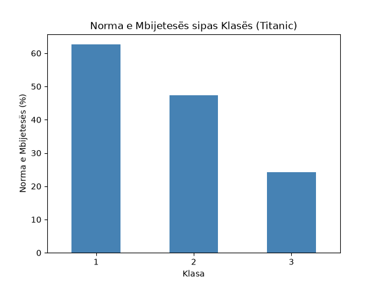

# CSV Analyzer — Titanic ETL Pipeline

A simple ETL (Extract, Transform, Load) pipeline built in Python that processes the Titanic dataset: loads raw CSV data, cleans and validates it, stores it in a SQLite database, and generates analysis and visualizations on passenger survival rates.

## Overview

This project demonstrates a complete data engineering workflow using a medallion architecture (raw → processed layers), from raw data ingestion to analyzed, queryable output.

**Pipeline steps:** Load → Clean → Validate → Analyze → Save (SQLite) → Query (SQL) → Visualize

## Visualization



Passengers in 1st class had a significantly higher survival rate (~63%) compared to 3rd class (~24%), reflecting the historical accounts of the disaster.

## Project Structure

csv-analyzer/
├── data/
│ ├── raw/ # Original, unmodified source data
│ │ └── titanic.csv
│ └── processed/ # Cleaned data and generated outputs
│ ├── titanic.db
│ └── survival_by_class.png
├── src/
│ ├── analyze.py # Data loading, cleaning, and analysis logic
│ ├── database.py # SQLite connection and query helpers
│ ├── validate.py # Data validation checks
│ └── visualize.py # Matplotlib visualizations
├── tests/
│ └── test_analyze.py # Unit tests (pytest)
├── requirements.txt
└── README.md

## Tech Stack

- **Python 3.12**
- **Pandas** — data cleaning and transformation
- **SQLite** — data storage and SQL querying
- **Matplotlib** — data visualization
- **Pytest** — unit testing

## How to Run

1. Clone the repository:
```bash
   git clone https://github.com/vlerakamberi/csv-analyzer.git
   cd csv-analyzer
```

2. Create and activate a virtual environment:
```bash
   python -m venv venv
   .\venv\Scripts\Activate.ps1
```

3. Install dependencies:
```bash
   pip install -r requirements.txt
```

4. Run the pipeline:
```bash
   python src/analyze.py
   python src/visualize.py
```

5. Run tests:
```bash
   pytest tests/
```

## Key Learnings

- Building a reproducible ETL pipeline with a clear raw/processed data separation
- Writing and reading from a SQLite database using both raw SQL and Pandas
- Validating data quality before analysis
- Creating clear, labeled data visualizations
- Testing data pipelines with pytest

## Author

Vlera Kamberi